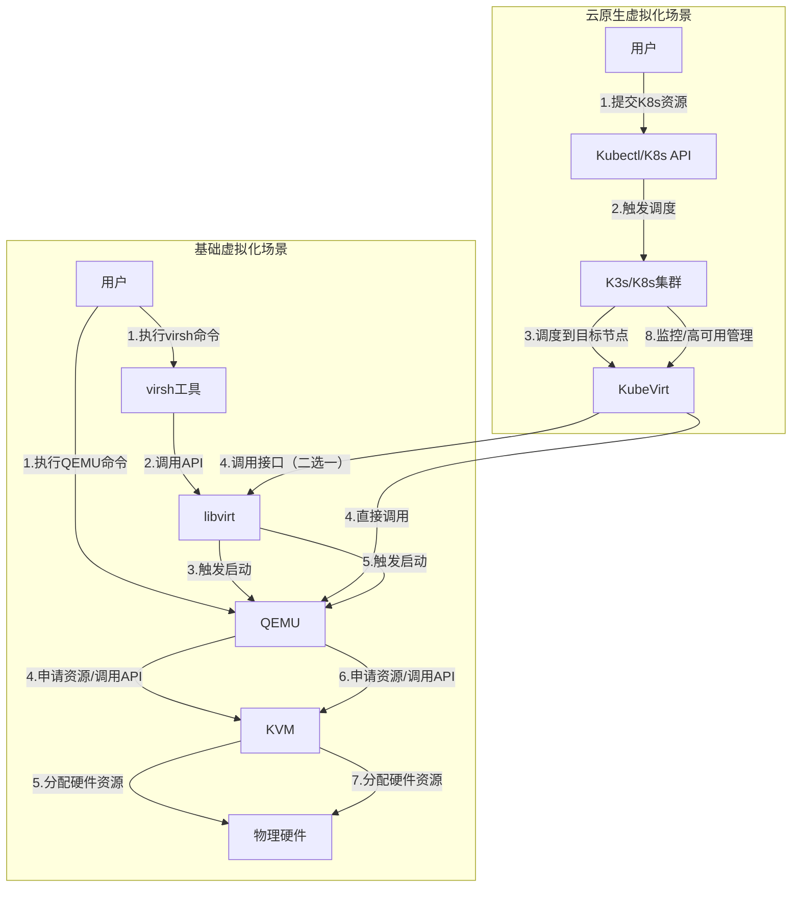

# KVM、QEMU、libvirt、KubeVirt、K3s 组件关系详细解析

本文专门针对 KVM、QEMU、libvirt、KubeVirt、K3s 核心组件的关系进行深度拆解，通过“组件定位-层级架构-交互逻辑-典型场景”的递进思路，清晰梳理各组件的分工与协同机制，帮助理解 Linux 虚拟化及云原生虚拟化场景下的核心技术架构。

---

## 一、核心组件单独定位：明确各自“职责边界”

要理清组件关系，首先需明确每个组件的本质、运行层级和核心作用，避免混淆“虚拟化能力提供者”“管理工具”“编排平台”等不同角色。

### 1. KVM：内核态硬件虚拟化加速核心

- **本质**：Linux 内核的一个模块（kvm.ko），并非独立软件，而是为内核新增硬件虚拟化能力，让 Linux 内核成为虚拟化监控器（Hypervisor）。

- **运行层级**：内核态（核心态），直接与硬件交互。

- **核心职责**：依托 CPU 硬件虚拟化扩展（Intel VT-x / AMD-V），实现 CPU 和内存的虚拟化加速——让虚拟机的指令可直接在物理 CPU 上执行（非根模式），仅在触发特权指令时通过 VM-Exit 交还给内核处理，大幅降低性能损耗。

- **局限性**：仅负责 CPU/内存虚拟化，不具备设备模拟（网卡、磁盘等）和虚拟机生命周期管理能力，无法独立使用，必须依赖用户态工具（如 QEMU）。

### 2. QEMU：用户态设备模拟与虚拟机管理前端

- **本质**：开源的用户态虚拟化模拟器，可独立运行，支持跨架构虚拟化（如 x86 模拟 ARM）。

- **运行层级**：用户态（应用层），通过系统调用与内核交互。

- **核心职责**：① 设备模拟：软件复刻网卡、磁盘、BIOS/UEFI 等硬件设备，让虚拟机操作系统能识别并使用虚拟硬件；② 虚拟机生命周期管理：处理虚拟机的创建、启动、暂停、关闭等操作；③ 协同 KVM：通过 KVM API 调用内核态的 KVM 能力，实现“硬件加速+设备模拟”的高性能虚拟化（即 QEMU-KVM 模式）。

- **两种运行模式**：纯 QEMU 模式（无 KVM，全软件模拟，性能差）、QEMU-KVM 模式（协同 KVM，硬件加速，生产环境主流）。

### 3. libvirt：虚拟化统一管理中间件（API 库）

- **本质**：开源的虚拟化 API 库，不提供虚拟化能力，仅封装底层虚拟化平台的接口。

- **运行层级**：用户态，介于上层管理工具与底层虚拟化组件之间。

- **核心职责**：屏蔽 KVM、QEMU、VMware 等不同虚拟化技术的底层差异，提供统一的管理 API（如创建虚拟机、快照、迁移），简化运维操作。

- **核心价值**：让上层工具（如 virsh、Virt-Manager、KubeVirt）无需关注底层虚拟化细节，用相同的接口即可管理不同虚拟化平台；同时提供批量管理、高级功能（迁移、存储池管理）支持。

- **依赖关系**：不依赖 KVM/QEMU，KVM/QEMU 也不依赖它（可直接通过 QEMU 命令行操作），属于“可选辅助组件”。

### 4. KubeVirt：云原生虚拟化桥梁（K8s 插件）

- **本质**：Kubernetes（K8s）的自定义资源（CRD）插件，本身不实现虚拟化。

- **运行层级**：用户态，依托 K8s 集群运行。

- **核心职责**：将虚拟机（VM）定义为 K8s 资源（如 VirtualMachine），让虚拟机可像容器一样被 K8s 编排管理（调度、高可用、网络存储集成），打通“容器”与“虚拟机”的协同壁垒。

- **核心依赖**：底层依赖 KVM/QEMU 提供虚拟化能力，上层依赖 K8s 提供编排平台；可通过 libvirt 或直接对接 QEMU-KVM 驱动与底层交互。

### 5. K3s：轻量化 K8s 发行版（编排底座）

- **本质**：简化版的 Kubernetes 发行版，移除了 K8s 中不必要的组件（如 Legacy 组件、非必需插件），体积小、部署简单。

- **运行层级**：用户态，作为容器/虚拟机的编排与运行平台。

- **核心职责**：为 KubeVirt 提供轻量化的 K8s 运行环境，负责资源调度（vCPU/内存分配）、高可用保障、网络存储集成等基础能力，适配边缘计算、小型环境等场景。

- **与虚拟化的关系**：不直接参与虚拟化，仅提供编排底座；KubeVirt 部署在 K3s 上后，即可借助 K3s 的能力实现虚拟机的集群化管理。

---

## 二、核心层级架构：从底层到上层的协同体系

上述组件并非孤立，而是形成“底层虚拟化引擎→中间管理封装→上层编排调度”的三层架构，每层组件各司其职、层层依赖，共同构成完整的虚拟化解决方案。

### 1. 三层架构拆解

|架构层级|核心组件|核心作用|依赖关系|
|---|---|---|---|
|底层：虚拟化引擎层|KVM + QEMU（QEMU-KVM 模式）+ VirtIO|提供高性能虚拟化能力：KVM 负责 CPU/内存加速，QEMU 负责设备模拟，VirtIO 优化 I/O 性能|QEMU 依赖 KVM 实现硬件加速；VirtIO 依赖 QEMU（后端）和虚拟机内驱动（前端）|
|中间：管理封装层|libvirt + virsh|提供统一管理接口，简化底层虚拟化组件的操作|依赖底层 KVM/QEMU 提供虚拟化能力；上层工具（如 KubeVirt）依赖其 API|
|上层：编排调度层|KubeVirt + K3s/K8s|实现虚拟机的云原生编排：调度、高可用、集群化管理|KubeVirt 依赖 K3s/K8s 提供编排底座，依赖底层 KVM/QEMU 提供虚拟化能力|
### 2. 关键组件依赖图谱

核心依赖逻辑（箭头表示“依赖/调用”）：

① 基础虚拟化场景：用户 → virsh → libvirt → QEMU → KVM → 物理硬件；或 用户 → QEMU 命令行 → KVM → 物理硬件

② 云原生虚拟化场景：用户 → Kubectl/K8s API → KubeVirt → （libvirt / 直接）→ QEMU-KVM → 物理硬件；且 KubeVirt 依赖 K3s/K8s 完成资源调度

为更直观理解依赖关系，以下通过流程图可视化呈现两个场景的组件协同路径：

流程图说明：
- 矩形框表示核心组件/角色，箭头表示依赖/调用方向，数字标记协同顺序；
- 基础场景中，用户可通过“virsh+libvirt”或直接“QEMU命令行”两种方式操作KVM；
- 云原生场景中，K3s/K8s负责资源调度与监控，KubeVirt作为桥梁对接底层虚拟化组件，支持通过libvirt或直接对接QEMU两种交互方式。

核心依赖逻辑（箭头表示“依赖/调用”）：

① 基础虚拟化场景：用户 → virsh → libvirt → QEMU → KVM → 物理硬件；或 用户 → QEMU 命令行 → KVM → 物理硬件

② 云原生虚拟化场景：用户 → Kubectl/K8s API → KubeVirt → （libvirt / 直接）→ QEMU-KVM → 物理硬件；且 KubeVirt 依赖 K3s/K8s 完成资源调度

---

## 三、核心交互逻辑：典型场景下的组件协同流程

通过两个典型场景，直观理解各组件的协同过程，明确每个环节中组件的具体分工。

### 场景1：基础环境下通过 virsh 启动虚拟机（依赖 libvirt）

1. 用户执行命令：`virsh start centos7`，发起虚拟机启动请求。

2. virsh 工具调用 libvirt API：virsh 本身不直接操作 KVM/QEMU，而是将请求传递给 libvirt。

3. libvirt 解析请求并调用 QEMU：libvirt 封装了 QEMU 的命令行/API，根据虚拟机的 XML 配置（如 vCPU、内存、镜像路径），触发 QEMU 进程启动。

4. QEMU 与 KVM 交互：QEMU 通过 KVM API（如 kvm_create_vm、kvm_create_vcpu）向内核态的 KVM 模块申请 CPU/内存资源。

5. KVM 分配硬件资源：KVM 借助 CPU 硬件虚拟化扩展，为虚拟机分配 vCPU 执行上下文和内存空间，建立二级页表（GVA→GPA→HPA）。

6. QEMU 完成设备初始化：QEMU 模拟 VirtIO 网卡、磁盘等设备，加载启动介质（如磁盘镜像），并调用 kvm_run API 启动 vCPU。

7. 虚拟机启动完成：vCPU 进入非根模式执行指令，引导虚拟机操作系统启动；运行过程中，QEMU 处理设备 I/O 请求，KVM 处理 VM-Exit 事件，libvirt 持续监控虚拟机状态。

### 场景2：K3s 环境下通过 KubeVirt 启动虚拟机（云原生场景）

1. 用户通过 Kubectl 提交请求：创建 VirtualMachine 资源（如 `kubectl apply -f centos7-vm.yaml`）。

2. K3s/K8s 调度资源：K3s 的调度器根据虚拟机的资源需求（如 2vCPU、4G 内存），将其调度到具备 KVM 能力的节点上。

3. KubeVirt 解析并触发虚拟化：KubeVirt 的控制器（virt-controller）监听到 VirtualMachine 资源后，通过 virt-launcher 组件在目标节点上触发虚拟机创建——可选择通过 libvirt API 调用 QEMU，或直接调用 QEMU-KVM 驱动。

4. 底层 QEMU-KVM 协同工作：后续流程与“基础场景”一致（QEMU 申请 KVM 资源、分配 vCPU/内存、模拟设备、启动虚拟机）。

5. K3s 监控与管理：K3s 持续监控虚拟机的运行状态，若节点故障，可将虚拟机调度到其他节点（高可用）；用户可通过 Kubectl 查看虚拟机状态（`kubectl get vms`）、执行启停操作。

---

## 四、核心关系总结：3 个关键结论

1. **“虚拟化能力核心”是 KVM+QEMU**：所有场景的虚拟化能力最终都依赖这对组合——KVM 提供硬件加速基础，QEMU 补全设备模拟和管理能力，两者是整个技术栈的“基石”。

2. **libvirt 是“简化管理的可选桥梁”**：它不改变底层虚拟化逻辑，仅通过统一 API 降低操作复杂度；基础场景可不用，云原生场景（KubeVirt）可按需选择是否依赖。

3. **KubeVirt+K3s 是“云原生扩展层”**：核心价值是将虚拟机纳入 K8s 编排体系，实现“容器与 VM 共存共管”；底层仍依赖 KVM+QEMU 提供虚拟化能力，K3s 则提供轻量化的编排底座。

简单类比理解：KVM 是“虚拟化发动机”，QEMU 是“发动机控制系统+车身模拟”，libvirt 是“简化的遥控装置”，KubeVirt 是“将遥控装置接入集群管理平台的适配器”，K3s 是“集群管理平台”。

---

## 五、面试问答专区：核心考点精析

本章节聚焦面试中高频考察的组件关系类问题，提供清晰的答题框架、核心要点及拓展思路，帮助快速掌握应答逻辑。

### 1. 高频问题1：KVM 和 QEMU 是什么关系？为什么生产环境要使用 QEMU-KVM 模式而非纯 QEMU 模式？

**答题要点**：

- 核心关系：互补协同，共同构成高性能虚拟化引擎。① KVM 是内核态硬件加速组件，仅负责 CPU/内存虚拟化，无设备模拟和管理能力；② QEMU 是用户态工具，负责设备模拟和虚拟机生命周期管理，可通过调用 KVM API 借助其硬件加速能力；③ QEMU-KVM 模式是两者的协同模式，整合了 KVM 的性能优势和 QEMU 的全功能优势。

- 模式对比：① 纯 QEMU 模式：无 KVM 依赖，全软件模拟 CPU/内存/设备，性能极差（CPU 利用率高、延迟大），仅适用于无硬件虚拟化扩展的场景；② QEMU-KVM 模式：借助 CPU 硬件虚拟化扩展实现硬件加速，CPU/内存操作接近物理机性能，QEMU 仅负责设备模拟（可通过 VirtIO 进一步优化 I/O），是生产环境主流选择。

**拓展思路**：可补充“VirtIO 与 QEMU-KVM 的协同作用”，说明设备模拟的性能瓶颈及 VirtIO 的优化逻辑，体现对虚拟化性能优化的深入理解。

### 2. 高频问题2：libvirt 是必需的吗？KubeVirt 为什么可以选择不依赖 libvirt 直接对接 QEMU？

**答题要点**：

- libvirt 非必需：① libvirt 是“管理中间件”，核心价值是封装底层虚拟化接口、提供统一 API，简化运维；② KVM/QEMU 可独立工作（如直接通过 QEMU 命令行启动虚拟机），无需 libvirt 依赖；③ 仅当需要标准化管理、批量操作或跨虚拟化平台管理时，才需要 libvirt。

- KubeVirt 可选对接方式的原因：① 核心逻辑：libvirt 是“可选封装层”，而非虚拟化能力的必需载体；② 直接对接 QEMU 的优势：减少中间层开销，提升性能；简化架构，降低依赖复杂度；③ 适用场景：对性能要求较高、架构轻量化的云原生环境；依赖 libvirt 的场景：需要兼容多虚拟化平台、利用 libvirt 高级功能（如存储池管理、迁移）的场景。

**拓展思路**：可对比“KubeVirt 两种对接方式的架构差异”，说明云原生环境下“轻量化、低延迟”的设计诉求，体现对云原生架构设计理念的理解。

### 3. 高频问题3：KubeVirt 和 K3s 分别扮演什么角色？它们与 KVM/QEMU 的依赖关系是什么？

**答题要点**：

- 角色定位：① KubeVirt：K8s 的 CRD 插件，核心角色是“云原生虚拟化桥梁”，不实现虚拟化能力，仅将虚拟机定义为 K8s 资源，让虚拟机可被 K8s 编排管理；② K3s：轻量化 K8s 发行版，核心角色是“编排底座”，为 KubeVirt 提供资源调度、高可用、网络存储集成等基础环境，不直接参与虚拟化。

- 依赖关系：① KubeVirt 依赖 KVM/QEMU：底层虚拟化能力最终由 KVM/QEMU 提供，KubeVirt 仅负责“虚拟化能力的云原生化封装”；② KubeVirt 依赖 K3s：需部署在 K3s/K8s 集群上，借助其编排能力实现虚拟机的集群化管理；③ K3s 与 KVM/QEMU 无直接依赖：K3s 是编排平台，可管理容器或通过 KubeVirt 管理虚拟机。

**拓展思路**：可举例说明“K3s+KubeVirt”的典型应用场景（如边缘计算环境的虚拟机管理），体现对技术落地场景的认知。

### 4. 高频问题4：请描述云原生场景下（K3s+KubeVirt）启动一台虚拟机的核心流程，说明各组件的分工。

**答题要点**：（按流程拆解，明确各组件职责）

1. 用户操作：通过 Kubectl 提交 VirtualMachine 资源 YAML 文件（定义 vCPU、内存、镜像等配置）。

2. K3s 调度：K3s 调度器根据资源需求和节点状态（如节点是否具备 KVM 能力），将虚拟机调度到目标工作节点。

3. KubeVirt 触发虚拟化：KubeVirt 的 virt-controller 监听资源变化，通过目标节点上的 virt-launcher 组件触发虚拟机创建，可选择通过 libvirt API 或直接调用 QEMU。

4. QEMU-KVM 协同：QEMU 接收请求后，通过 KVM API 向内核申请 CPU/内存资源；KVM 借助硬件虚拟化扩展分配资源，建立内存页表；QEMU 模拟 VirtIO 设备，加载启动介质。

5. 虚拟机启动与监控：QEMU 启动 vCPU，引导虚拟机操作系统启动；K3s 持续监控虚拟机状态，实现高可用（如节点故障时调度到其他节点）；用户可通过 Kubectl 查看/管理虚拟机。

**拓展思路**：可对比“基础场景（virsh+libvirt）与云原生场景启动流程的差异”，突出云原生场景“编排化、集群化、高可用”的优势。

### 5. 高频问题5：为什么说 KVM 是 Hypervisor？它与传统的 Type 1 Hypervisor（如 VMware ESXi）有什么区别？

**答题要点**：

- KVM 是 Hypervisor 的原因：Hypervisor 是虚拟化监控器，负责管理硬件资源并为虚拟机提供隔离的执行环境；KVM 作为 Linux 内核模块，让 Linux 内核具备了 Hypervisor 的核心能力（CPU/内存虚拟化、虚拟机隔离），因此属于 Type 2 Hypervisor（宿主型 Hypervisor）。

- 与 Type 1 Hypervisor（ESXi）的区别：① 运行架构：KVM 依赖 Linux 内核运行（宿主型），ESXi 直接运行在硬件上（裸金属型）；② 资源开销：KVM 存在内核态-用户态切换开销，ESXi 无宿主操作系统开销，理论性能更优；③ 生态兼容性：KVM 依托 Linux 生态，兼容性强（支持多种硬件/操作系统），ESXi 生态封闭但运维更简单；④ 部署成本：KVM 开源免费，ESXi 商业收费。

**拓展思路**：可结合实际应用场景说明选择逻辑（如中小企业选 KVM 降低成本，企业级生产环境选 ESXi 追求稳定性），体现技术选型的辩证思维。
> （注：文档部分内容可能由 AI 生成）