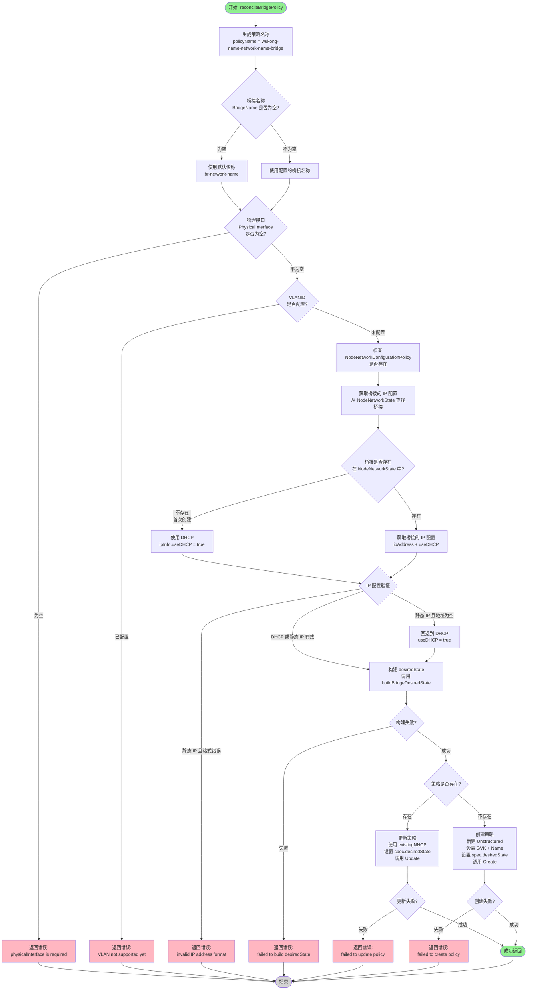

# reconcileBridgePolicy 方法流程图

## 流程图



## buildBridgeDesiredState 子流程

```mermaid
flowchart TD
    Start([开始: buildBridgeDesiredState]) --> BuildBridgeInterface[构建桥接接口配置<br/>name: bridgeName<br/>type: linux-bridge<br/>state: up<br/>bridge.port: physicalInterface<br/>bridge.options.stp: false]
    
    BuildBridgeInterface --> CheckIPMode{IP 模式?}
    CheckIPMode -->|DHCP| ConfigDHCP[配置桥接 IPv4<br/>enabled: true<br/>dhcp: true]
    CheckIPMode -->|静态 IP| ParseIP[解析 IP 地址<br/>格式: 192.168.1.100/24]
    
    ParseIP --> ParseError{解析失败?}
    ParseError -->|失败| Error[返回错误:<br/>failed to parse IP]
    ParseError -->|成功| ConfigStaticIP[配置桥接 IPv4<br/>enabled: true<br/>dhcp: false<br/>address: ip/prefix-length]
    
    ConfigDHCP --> AddBridgeInterface
    ConfigStaticIP --> AddBridgeInterface
    
    AddBridgeInterface[将桥接接口添加到 interfaces 列表]
    AddBridgeInterface --> BuildPhysicalInterface[构建物理接口配置<br/>name: physicalInterface<br/>type: ethernet<br/>state: up<br/>ipv4.enabled: false]
    
    BuildPhysicalInterface --> AddPhysicalInterface[将物理接口添加到 interfaces 列表]
    AddPhysicalInterface --> Return[返回 desiredState<br/>interfaces: [...]]
    
    Return --> End([结束])
    Error --> End
    
    style Start fill:#90EE90
    style Return fill:#90EE90
    style Error fill:#FFB6C1
    style End fill:#D3D3D3
```

## 关键点说明

### 1. IP 配置获取逻辑
- **桥接已存在**：从 NodeNetworkState 获取桥接的 IP 配置
- **桥接不存在**（首次创建）：使用 DHCP
- **注意**：物理接口没有 IP（`ipv4.enabled: false`），IP 在桥接上

### 2. 错误处理
- 物理接口为空 → 返回错误
- VLAN 已配置 → 返回错误（暂不支持）
- IP 地址格式错误 → 返回错误
- 策略创建/更新失败 → 返回错误

### 3. desiredState 结构
```yaml
interfaces:
  # 桥接接口
  - name: br-external
    type: linux-bridge
    state: up
    bridge:
      options:
        stp:
          enabled: false
      port:
        - name: ens192
    ipv4:
      enabled: true
      dhcp: true  # 或静态 IP 配置
  
  # 物理接口（禁用 IP）
  - name: ens192
    type: ethernet
    state: up
    ipv4:
      enabled: false
```

### 4. 策略名称规则
- 格式：`{wukong-name}-{network-name}-bridge`
- 示例：`my-vm-external-bridge`

### 5. 桥接名称规则
- 如果配置了 `BridgeName`：使用配置的值
- 如果未配置：使用默认格式 `br-{network-name}`
- 示例：`br-external`

